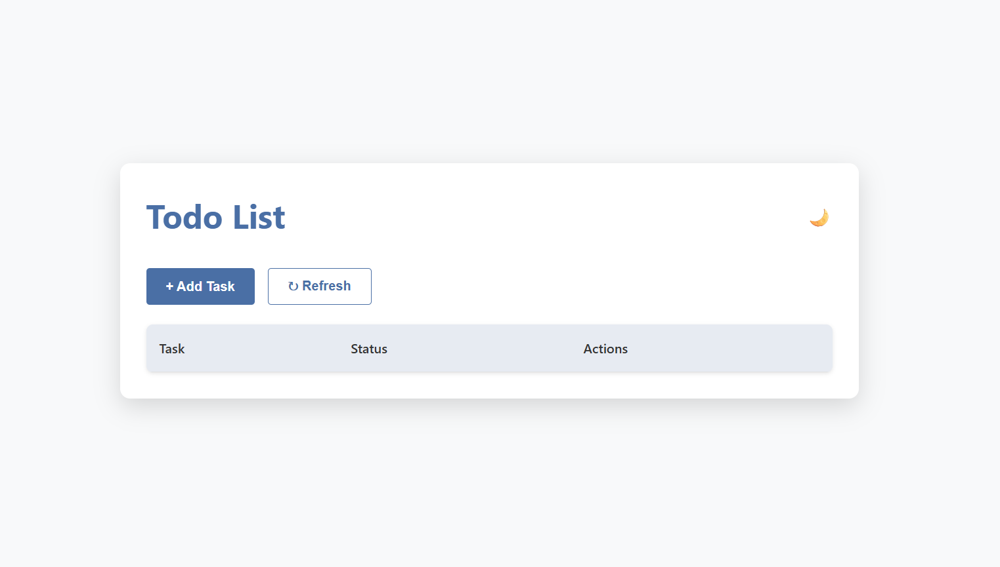

# 📝 Todo List Application

[](https://to-do-list-nine-navy-86.vercel.app/)
[](https://github.com/your-username/todo-list-app)

A modern, responsive Todo List with dark mode - built with pure HTML, CSS, and JavaScript.

 

## ✨ Features

- ✅ **Add/Delete tasks** with one click
- 🌓 **Dark/Light mode** (auto-saves preference)
- 🔄 **Refresh button** with confirmation
- 📱 **Fully responsive** design
- 🎨 **Sleek UI** with shadow effects
- ⚡ **Fast loading** (static Vercel deployment)

## 🚀 Quick Start

1. **Using the Live App**:  
   Visit → [https://to-do-list-nine-navy-86.vercel.app/](https://to-do-list-nine-navy-86.vercel.app/)

2. **Run Locally**:
   ```bash
   git clone https://github.com/mehtatanay04/ToDoList.git
   cd ToDoList
   open index.html
